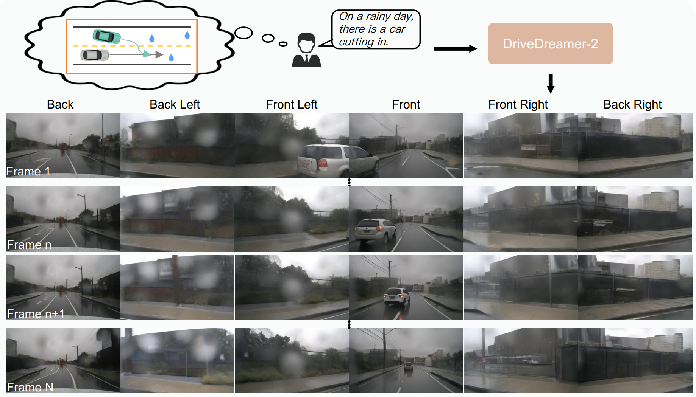
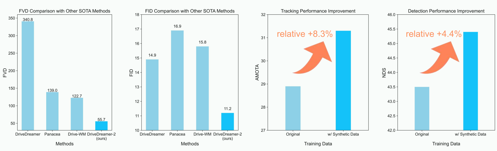
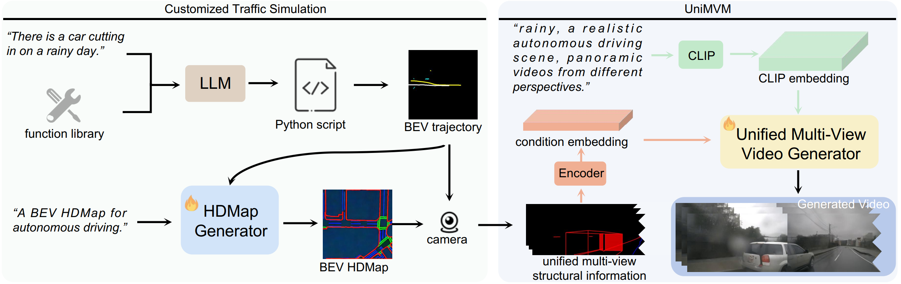

<div align="center">   

# DriveDreamer-2: LLM-Enhanced World Models for Diverse Driving Video Generation
</div>

Our team is actively working towards releasing the code for this project. 

We appreciate your patience and understanding as we navigate the necessary processes.
 
## [Project Page](https://drivedreamer2.github.io) | [Paper](https://arxiv.org/pdf/2403.06845.pdf)

# Abstract 

World models have demonstrated superiority in autonomous driving, particularly in the generation of multi-view driving videos. However, significant challenges still exist in generating customized driving videos. In this paper, we propose DriveDreamer-2, which builds upon the framework of DriveDreamer and incorporates a Large Language Model (LLM) to generate user-defined driving videos. Specifically, an LLM interface is initially incorporated to convert a user's query into agent trajectories. Subsequently, a HDMap, adhering to traffic regulations, is generated based on the trajectories. Ultimately, we propose the  Unified Multi-View Model to enhance temporal and spatial coherence in the generated driving videos. DriveDreamer-2 is the first world model to generate customized driving videos, it can generate uncommon driving videos (e.g., vehicles abruptly cut in) in a user-friendly manner. Besides, experimental results demonstrate that the generated videos enhance the training of driving perception methods (e.g., 3D detection and tracking). Furthermore, video generation quality of DriveDreamer-2 surpasses other state-of-the-art methods, showcasing FID and FVD scores of 11.2 and 55.7, representing relative improvements of 30% and 50%.





# News
- **[2024/03/11]** Repository Initialization.


# Demo
## Results with Gnerated Structural Information
**Daytime / rainy day / at night, a car abruptly cutting in from the right rear of ego-car.**

<video preload="auto" src="./media/videos/cut_in_right.mp4" poster="" id="tree" autoplay controls muted loop width="1000px" outline="0px" >
</video>

**Rainy day, car abruptly cutting in from the left rear of ego-car. (long video)**

<video preload="auto" src="./media/videos/long/cut_in.mp4" poster="" id="tree" autoplay controls muted loop width="1000px" outline="0px" >
</video>


**Daytime, the ego-car changes lanes to the right side. (long video)**

<video preload="auto" src="./media/videos/long/change_lane.mp4" poster="" id="tree" autoplay controls muted loop width="1000px" outline="0px" >
</video>

**At night, a person crossing the road in the front of the ego-car. (long video)**

<video preload="auto" src="./media/videos/long/crossing_road.mp4" poster="" id="tree" autoplay controls muted loop width="1000px" outline="0px" >
</video>

**At night, a person crossing the road in the front of the ego-car. (long video)**

<video preload="auto" src="./media/videos/long/crossing_road.mp4" poster="" id="tree" autoplay controls muted loop width="1000px" outline="0px" >
</video>

## Results with nuScenes Structural Information

**Daytime / rainy day / at Night, ego-car drives through urban street, surrounded by a flow of vehicles on both sides.**

<video preload="auto" src="./media/videos/vehicle_both_side.mp4" poster="" id="tree" autoplay controls muted loop width="1000px" outline="0px" >
</video>

**Daytime / rainy day / at night, a bus is positioned to the left front of the ego-car, with a pedestrian near the bus.**

<video preload="auto" src="./media/videos/bus.mp4" poster="" id="tree" autoplay controls muted loop width="1000px" outline="0px" >
</video>

**Rainy day, the windshield wipers of the truck are continuously clearing the windshield.**

<video preload="auto" src="./media/videos/windshield_wiper.mp4" poster="" id="tree" autoplay controls muted loop width="1000px" outline="0px" >
</video>

**Rainy day, the ego-car makes a left turn at the traffic signal, with vehicles behind proceeding straight through the intersection. (long video)**

<video preload="auto" src="./media/videos/long/long1.mp4" poster="" id="tree" autoplay controls muted loop width="1000px" outline="0px" >
</video>

**Daytime, the ego-car drives straight through the traffic light, with a truck situated to the left front and pedestrians crossing on the right side. (long video)**

<video preload="auto" src="./media/videos/long/long2.mp4" poster="" id="tree" autoplay controls muted loop width="1000px" outline="0px" >
</video>


**DriveDreamer-2 Framework**





# Bibtex
If this work is helpful for your research, please consider citing the following BibTeX entry.

```
@article{zhao2024drive,
  title={DriveDreamer-2: LLM-Enhanced World Models for Diverse Driving Video Generation},
  author={Zhao, Guosheng and Wang, Xiaofeng and Zhu, Zheng and Chen, Xinze and Huang, Guan and Bao, Xiaoyi and Wang, Xingang},
  journal={arXiv preprint arXiv:2403.06845},
  year={2024}
}
```

